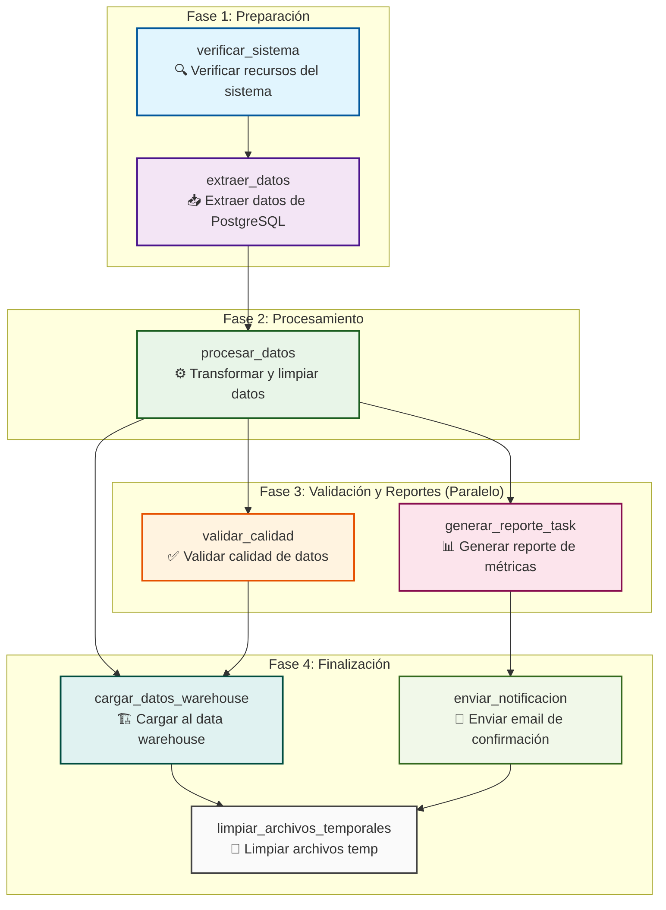

# 4. Automatización y Orquestación con Apache Airflow

## 4.2. DAGs, operadores y tareas

**Objetivo**:

Comprender, diseñar y construir flujos de trabajo programables en Apache Airflow utilizando DAGs, operadores y tareas, incluyendo su agrupación, parametrización y personalización para gestionar eficientemente flujos de datos complejos en entornos Big Data.

**Introducción**:

Apache Airflow permite definir y gestionar flujos de trabajo como código, a través de DAGs (Directed Acyclic Graphs), que representan secuencias de tareas con dependencias explícitas. Este enfoque permite un control detallado del orden de ejecución, la lógica condicional, la integración con diversas herramientas y servicios, y la reutilización de código para tareas repetitivas. En este tema se profundiza en cómo construir DAGs robustos, emplear operadores integrados y personalizados, utilizar estructuras avanzadas como TaskGroups y SubDAGs, y aplicar templating dinámico con Jinja2.

**Desarrollo**:

La definición de flujos de trabajo (pipelines) en Apache Airflow se basa en DAGs que agrupan tareas individuales y definen la lógica de ejecución. Cada tarea puede realizar operaciones diversas como ejecutar comandos del sistema, procesar datos con Spark, mover datos entre servicios cloud, o enviar notificaciones. Airflow proporciona una gran variedad de operadores listos para usar y permite crear operadores personalizados. También ofrece herramientas para organizar tareas y aplicar plantillas dinámicas, lo cual facilita el mantenimiento y escalabilidad de flujos complejos.

### 4.2.1 Definición y estructura de DAGs

Un **DAG** (Directed Acyclic Graph) es la pieza fundamental de Apache Airflow que representa un flujo de trabajo completo como un grafo dirigido sin ciclos.

Cada DAG puede ser:

- **Dirigido**: Las tareas tienen un orden específico de ejecución (flujo direccional)
- **Acíclico**: No puede haber bucles infinitos o dependencias circulares
- **Grafo**: Conjunto de nodos (tareas) conectados por aristas (dependencias)

##### Parámetros Esenciales

Son los parámetros fundamentales que definen el comportamiento básico de un DAG en Apache Airflow.

```python
# Parámetros obligatorios
dag_id='nombre_unico_del_dag'     # identificador único en todo Airflow
start_date=datetime(2024, 1, 1)   # fecha desde cuando puede ejecutarse
schedule_interval='@daily'        # frecuencia de ejecución

# Parámetros importantes
catchup=False                     # si ejecutar ejecuciones pasadas
max_active_runs=1                 # número máximo de ejecuciones simultáneas
default_retries=1                 # reintentos por defecto para todas las tareas
retry_delay=timedelta(minutes=5)  # tiempo entre reintentos
default_args = {                  # parámetros que heredan todas las tareas del DAG
    'owner': 'team_data',
    'retries': 2,
    'retry_delay': timedelta(minutes=5),
    'email_on_failure': True,
    'email': ['alerts@empresa.com']
}
```

**Planificación de la Ejecución (Scheduling)**

Hay varias formas de configurar la frecuencias de ejecución:

```python
# Opciones de schedule_interval
'@once'        # Ejecutar solo una vez
'@hourly'      # Cada hora (0 * * * *)
'@daily'       # Diariamente a medianoche (0 0 * * *)
'@weekly'      # Semanalmente los domingos (0 0 * * 0)
'@monthly'     # Primer día de cada mes (0 0 1 * *)
'@yearly'      # 1 de enero cada año (0 0 1 1 *)

# Cron personalizado
'30 6 * * 1-5' # 6:30 AM, lunes a viernes
'0 */4 * * *'  # Cada 4 horas

# Programático
timedelta(hours=2)              # Cada 2 horas
timedelta(days=1, hours=12)     # Cada día y medio
```

##### Estructura básica de un DAG

```python
from airflow import DAG
from airflow.operators.bash import BashOperator
from datetime import datetime

with DAG(
    dag_id='mi_primer_dag',
    start_date=datetime(2024, 1, 1),
    schedule_interval='@daily',
    catchup=False,
    tags=['ejemplo']
) as dag:

    tarea_1 = BashOperator(
        task_id='imprimir_fecha',
        bash_command='date'
    )

    tarea_2 = BashOperator(
        task_id='mostrar_hola_mundo',
        bash_command='echo "Hola mundo desde Airflow!"'
    )

    tarea_1 >> tarea_2  # Define la dependencia
```

##### DAG Completo y Detallado

**Diagrama**:



**Implementación**:

```python
from airflow import DAG
from airflow.operators.bash import BashOperator
from airflow.operators.python import PythonOperator
from airflow.operators.email import EmailOperator
from datetime import datetime, timedelta
import pandas as pd
import logging

# Estos argumentos se aplicarán a todas las tareas del DAG
# a menos que se sobrescriban específicamente
default_args = {
    'owner': 'equipo_data_engineering',          # Responsable del DAG
    'depends_on_past': False,                    # No depende de ejecuciones anteriores
    'start_date': datetime(2024, 1, 1),          # Fecha de inicio del DAG
    'email_on_failure': True,                    # Enviar email si falla
    'email_on_retry': False,                     # No enviar email en reintento
    'email': ['team@empresa.com'],               # Lista de emails para notificaciones
    'retries': 2,                                # Número de reintentos por tarea
    'retry_delay': timedelta(minutes=5),         # Tiempo entre reintentos
    'execution_timeout': timedelta(hours=2),     # Timeout máximo por tarea
}

# DEFINICIÓN DEL DAG
with DAG(
    # Identificador único del DAG en toda la instancia de Airflow
    dag_id='pipeline_procesamiento_ventas_v2',
    
    # Hereda la configuración por defecto definida arriba
    default_args=default_args,
    
    # Descripción que aparece en la UI de Airflow
    description='Pipeline completo para procesar datos de ventas diarias',
    
    # Frecuencia de ejecución - se ejecuta diariamente a las 2:00 AM
    schedule_interval='0 2 * * *',
    
    # No ejecutar DAGs para fechas pasadas (evita backfill automático)
    catchup=False,
    
    # Solo una instancia del DAG puede ejecutarse simultáneamente
    max_active_runs=1,
    
    # Tags para organizar DAGs en la UI
    tags=['ventas', 'etl', 'produccion', 'diario'],
    
    # Documentación en formato Markdown
    doc_md="""
    ## Pipeline de Procesamiento de Ventas
    
    Este DAG procesa los datos de ventas diarias:
    1. Extrae datos de la base de datos transaccional
    2. Aplica transformaciones y limpieza
    3. Carga los datos al data warehouse
    4. Envía reporte de resumen por email
    
    **Dependencias externas**: Base de datos PostgreSQL, S3 bucket
    **Tiempo estimado**: 45 minutos
    **Criticidad**: Alta - bloquea reportes ejecutivos
    """,
    
) as dag:

    # FUNCIÓN PYTHON PERSONALIZADA
    def procesar_datos_ventas(**context):
        """
        Función que procesa los datos de ventas.
        **context contiene información del contexto de ejecución de Airflow
        """
        # Obtener la fecha de ejecución del contexto
        execution_date = context['execution_date']
        
        # Simular procesamiento de datos
        logging.info(f"Procesando datos de ventas para {execution_date}")
        
        # En un caso real, aquí harías:
        # - Conexión a base de datos
        # - Extracción de datos
        # - Transformaciones con pandas/spark
        # - Validaciones de calidad
        
        # Retornar métricas para usar en tareas posteriores
        return {
            'registros_procesados': 15420,
            'ventas_totales': 89750.50,
            'fecha_proceso': execution_date.strftime('%Y-%m-%d')
        }

    def generar_reporte(**context):
        """Genera un reporte basado en los datos procesados"""
        # Obtener datos de la tarea anterior usando XCom
        datos_ventas = context['task_instance'].xcom_pull(task_ids='procesar_datos')
        
        reporte = f"""
        Reporte de Ventas - {datos_ventas['fecha_proceso']}
        ================================================
        Registros procesados: {datos_ventas['registros_procesados']:,}
        Ventas totales: ${datos_ventas['ventas_totales']:,.2f}
        """
        
        logging.info(reporte)
        return reporte

    # DEFINICIÓN DE TAREAS
    
    # TAREA 1: Verificación del sistema
    verificar_sistema = BashOperator(
        task_id='verificar_sistema',
        # Comando bash que verifica conectividad y recursos
        bash_command="""
        echo "Verificando sistema..."
        df -h | grep -v tmpfs  # Verificar espacio en disco
        echo "Sistema verificado correctamente"
        """,
        # Documentación específica de la tarea
        doc_md="""
        ### Verificación del Sistema
        Valida que el sistema tenga los recursos necesarios:
        - Espacio en disco suficiente
        - Conectividad de red
        - Servicios requeridos activos
        """
    )

    # TAREA 2: Extracción de datos
    extraer_datos = BashOperator(
        task_id='extraer_datos',
        bash_command="""
        echo "Iniciando extracción de datos..."
        # En producción, esto sería algo como:
        # psql -h $DB_HOST -d ventas -c "COPY (...) TO STDOUT" > /tmp/ventas_{{ ds }}.csv
        echo "Simulando extracción de 15,420 registros"
        echo "Datos extraídos exitosamente"
        """,
        # Esta tarea puede fallar ocasionalmente, aumentamos reintentos
        retries=3,
        retry_delay=timedelta(minutes=2)
    )

    # TAREA 3: Procesamiento con Python
    procesar_datos = PythonOperator(
        task_id='procesar_datos',
        python_callable=procesar_datos_ventas,
        # Proporcionar el contexto de Airflow a la función
        provide_context=True
    )

    # TAREA 4: Validación de calidad
    validar_calidad = BashOperator(
        task_id='validar_calidad',
        bash_command="""
        echo "Ejecutando validaciones de calidad de datos..."
        # Simular validaciones
        echo "✓ Sin valores nulos en campos críticos"
        echo "✓ Rangos de fechas válidos"
        echo "✓ Integridad referencial correcta"
        echo "Validación completada exitosamente"
        """
    )

    # TAREA 5: Carga al data warehouse
    cargar_datos = BashOperator(
        task_id='cargar_datos_warehouse',
        bash_command="""
        echo "Cargando datos al data warehouse..."
        # En producción sería algo como:
        # aws s3 cp /tmp/ventas_processed_{{ ds }}.parquet s3://warehouse/ventas/
        echo "Datos cargados exitosamente al data warehouse"
        """
    )

    # TAREA 6: Generación de reporte
    generar_reporte_task = PythonOperator(
        task_id='generar_reporte',
        python_callable=generar_reporte,
        provide_context=True
    )

    # TAREA 7: Envío de notificación por email
    enviar_notificacion = EmailOperator(
        task_id='enviar_notificacion',
        to=['gerencia@empresa.com', 'ventas@empresa.com'],
        subject='Pipeline de Ventas Completado - {{ ds }}',
        html_content="""
        <h3>Pipeline de Procesamiento de Ventas</h3>
        <p><strong>Fecha:</strong> {{ ds }}</p>
        <p><strong>Estado:</strong> Completado exitosamente ✅</p>
        <p><strong>Tiempo de ejecución:</strong> {{ macros.datetime.now() }}</p>
        
        <p>Los datos de ventas han sido procesados y están disponibles en el data warehouse.</p>
        
        <hr>
        <small>Este es un mensaje automático del sistema de orquestación de datos.</small>
        """
    )

    # TAREA 8: Limpieza de archivos temporales
    limpiar_archivos = BashOperator(
        task_id='limpiar_archivos_temporales',
        bash_command="""
        echo "Limpiando archivos temporales..."
        # rm -f /tmp/ventas_{{ ds }}.*
        echo "Limpieza completada"
        """,
        # Esta tarea no es crítica, si falla no debe afectar el pipeline
        trigger_rule='all_done'  # Se ejecuta sin importar si las anteriores fallan
    )

    # DEFINICIÓN DE DEPENDENCIAS
    
    # Secuencia lineal básica
    verificar_sistema >> extraer_datos >> procesar_datos
    
    # Después del procesamiento, dos ramas paralelas
    procesar_datos >> [validar_calidad, generar_reporte_task]
    
    # La carga depende de que tanto el procesamiento como la validación sean exitosos
    [procesar_datos, validar_calidad] >> cargar_datos
    
    # El reporte se puede generar en paralelo con la carga
    generar_reporte_task >> enviar_notificacion
    
    # La limpieza se ejecuta al final, después de todo
    [cargar_datos, enviar_notificacion] >> limpiar_archivos

```


### 4.2.2 Operadores built-in y custom operators

Los **operadores** son las unidades de ejecución en Airflow. Representan tareas concretas que se ejecutan en el DAG. Airflow incluye múltiples operadores built-in y permite crear operadores personalizados para extender su funcionalidad.

##### Operadores de Ejecución Básica

Estos operadores permiten ejecutar comandos del sistema, scripts, o funciones personalizadas.

* `BashOperator`: Fundamental para ejecutar comandos del sistema, scripts shell y herramientas CLI de big data como Hadoop, Spark-submit, etc.
* `PythonOperator`: Crítico para ejecutar funciones Python personalizadas, transformaciones de datos y lógica de negocio
* `EmailOperator`: Esencial para notificaciones y alertas en pipelines de producción

```python
from airflow.operators.bash import BashOperator
from airflow.operators.python import PythonOperator

def saludar():
    print("Hola desde PythonOperator")

tarea_bash = BashOperator(
    task_id='tarea_bash',
    bash_command='echo "Ejecutando comando Bash"',
    dag=dag
)

tarea_python = PythonOperator(
    task_id='tarea_python',
    python_callable=saludar,
    dag=dag
)
```

##### Operadores de Bases de Datos

Estos operadores permiten ejecutar consultas SQL directamente desde Airflow hacia motores relacionales o embebidos.

* `PostgresOperator`/`MySqlOperator`: Para ejecutar consultas SQL en bases de datos relacionales
* `SqliteOperator`: Útil para pruebas y desarrollo local

```python
from airflow.providers.postgres.operators.postgres import PostgresOperator

tarea_sql = PostgresOperator(
    task_id='crear_tabla',
    postgres_conn_id='mi_conexion_postgres',
    sql='CREATE TABLE IF NOT EXISTS tabla_ejemplo (id SERIAL PRIMARY KEY);',
    dag=dag
)
```

##### Operadores de Transferencia

Son usados para mover datos entre servicios, especialmente en la nube.

* `S3ToRedshiftOperator`: Transferir datos desde S3 a Redshift (muy común en AWS)
* `BigQueryOperator`: Para operaciones en Google BigQuery
* `RedshiftToS3Operator`: Exportar datos desde Redshift

```python
from airflow.providers.amazon.aws.transfers.s3_to_redshift import S3ToRedshiftOperator

tarea_transferencia = S3ToRedshiftOperator(
    task_id='s3_a_redshift',
    s3_bucket='mi-bucket',
    s3_key='datos.csv',
    schema='public',
    table='mi_tabla',
    copy_options=['csv'],
    aws_conn_id='aws_default',
    redshift_conn_id='redshift_default',
    dag=dag
)
```

##### Operadores de Control de Flujo

Controlan la lógica de ejecución dentro de un DAG.

* `BranchPythonOperator`: Para lógica condicional en el pipeline
* `EmptyOperator` (antes `DummyOperator`): Para puntos de sincronización
* `TriggerDagRunOperator`: Para activar otros DAGs

```python
from airflow.operators.empty import EmptyOperator
from airflow.operators.branch import BranchPythonOperator

def decidir():
    return 'tarea_a' if datetime.now().hour < 12 else 'tarea_b'

rama = BranchPythonOperator(
    task_id='evaluar_ruta',
    python_callable=decidir,
    dag=dag
)

tarea_a = EmptyOperator(task_id='tarea_a', dag=dag)
tarea_b = EmptyOperator(task_id='tarea_b', dag=dag)

rama >> [tarea_a, tarea_b]
```

##### Operadores para Spark y Hadoop

Permiten ejecutar aplicaciones en motores de procesamiento distribuido.

* `SparkSubmitOperator`: Ejecutar aplicaciones Spark (batch processing)
* `DataprocSubmitJobOperator`: Para trabajos en Google Cloud Dataproc
* `EMRStepOperator`: Para clusters Amazon EMR

```python
from airflow.providers.apache.spark.operators.spark_submit import SparkSubmitOperator

spark_job = SparkSubmitOperator(
    task_id='ejecutar_spark',
    application='/ruta/a/mi_app_spark.py',
    conn_id='spark_default',
    dag=dag
)
```

##### Operadores para Streaming y HDFS

Permiten flujos en tiempo real y acceso a HDFS

* `KafkaOperator`: Interactuar con Apache Kafka para datos en tiempo real
* `HDFSOperator`: Operaciones en Hadoop Distributed File System

```python
from airflow.providers.apache.hdfs.sensors.hdfs import HdfsSensor

esperar_archivo = HdfsSensor(
    task_id='esperar_archivo_hdfs',
    filepath='/data/input/archivo.csv',
    hdfs_conn_id='hdfs_default',
    dag=dag
)
```

##### Operadores para Validación de Datos

Permiten realizar validaciones sobre los datos

* `GreatExpectationsOperator`: Validación de calidad de datos
* `Custom Data Validation Operators`: Para reglas específicas del negocio

```python
from airflow.providers.great_expectations.operators.great_expectations import GreatExpectationsOperator

validacion = GreatExpectationsOperator(
    task_id='validar_datos',
    data_context_root_dir='/opt/ge/',
    checkpoint_name='check_ventas',
    dag=dag
)
```

##### Operadores para MLOps

Flujos relacionados con procesos de Machine Learning

* `MLflowOperator`: Para experimentos y modelos de machine learning
* `KubernetesOperator`: Para ejecutar contenedores en Kubernetes

```python
from airflow.providers.cncf.kubernetes.operators.kubernetes_pod import KubernetesPodOperator

ml_entrenamiento = KubernetesPodOperator(
    task_id='entrenar_modelo',
    name='ml-train',
    image='ml/entrenamiento:latest',
    dag=dag
)
```

### 4.2.3 TaskGroups

Cuando los DAGs crecen en complejidad (más de 10-15 tareas), surgen varios problemas:

* Legibilidad: Difícil entender el flujo en la UI de Airflow
* Mantenimiento: Código desordenado y difícil de modificar
* Reutilización: Patrones repetitivos sin forma de encapsular
* Colaboración: Equipos diferentes trabajando en el mismo DAG
* Debugging: Difícil identificar grupos de tareas relacionadas

La solución es agrupar tareas lógicamente relacionadas usando TaskGroups.

Nota: Existe un mecanismo adicional llamado SubDAGs, pero ya es considerado obsoleto.

##### Uso de TaskGroups

Los TaskGroups son una forma de organizar tareas visualmente en la UI de Airflow sin crear DAGs separados.

Introducidos en Airflow 2.0, son la mejor práctica actual para estructurar DAGs complejos.

Ventajas de **TaskGroups**

- Organización visual: Agrupa tareas en la UI de Airflow
- Reutilización de código: Encapsula lógica repetitiva
- Mejor rendimiento: No crean procesos separados como SubDAGs
- Simplicidad: Fácil de usar y entender
- Debugging mejorado: Logs y estados agrupados
- Escalabilidad: Maneja DAGs con cientos de tareas

Los `TaskGroup` permiten agrupar visual y lógicamente tareas relacionadas dentro de un DAG.

**Ejemplo de un TaskGroup**:

```python
from airflow import DAG
from airflow.operators.bash import BashOperator
from airflow.operators.python import PythonOperator
from airflow.utils.task_group import TaskGroup
from datetime import datetime, timedelta

# Configuración del DAG
with DAG(
    dag_id='pipeline_con_taskgroups_v1',
    start_date=datetime(2024, 1, 1),
    schedule_interval='@daily',
    catchup=False,
    tags=['taskgroups', 'ejemplo']
) as dag:

    # TASKGROUP 1: PREPARACIÓN DE DATOS
    with TaskGroup(
        group_id='preparacion_datos',
        tooltip='Descarga, validación y limpieza de datos raw'
    ) as grupo_preparacion:
        
        # Tarea 1: Descargar datos de múltiples fuentes
        descargar_datos = BashOperator(
            task_id='descargar_datos',
            bash_command='''
            echo "Descargando datos de APIs y bases de datos..."
            # Simular descarga de múltiples fuentes
            echo "✓ API de ventas: 15,420 registros"
            echo "✓ API de clientes: 8,932 registros"
            echo "✓ DB transaccional: 45,123 registros"
            '''
        )
        
        # Tarea 2: Validar integridad de los datos
        validar_integridad = BashOperator(
            task_id='validar_integridad',
            bash_command='''
            echo "Validando integridad de datos descargados..."
            echo "✓ Verificando checksums"
            echo "✓ Validando esquemas JSON/CSV"
            echo "✓ Contando registros esperados"
            '''
        )
        
        # Tarea 3: Limpiar y estandarizar datos
        limpiar_datos = PythonOperator(
            task_id='limpiar_datos',
            python_callable=lambda: print("""
            Limpiando datos:
            ✓ Removiendo duplicados
            ✓ Estandarizando formatos de fecha
            ✓ Normalizando nombres y direcciones
            ✓ Aplicando reglas de negocio
            """)
        )
        
        # Dependencias dentro del TaskGroup
        descargar_datos >> validar_integridad >> limpiar_datos

    # TASKGROUP 2: TRANSFORMACIONES DE NEGOCIO
    with TaskGroup(
        group_id='transformaciones_negocio',
        tooltip='Aplicar reglas de negocio y cálculos complejos'
    ) as grupo_transformaciones:
        
        def calcular_metricas_ventas():
            print("Calculando métricas de ventas:")
            print("✓ Revenue por región")
            print("✓ Customer Lifetime Value")
            print("✓ Churn rate")
            print("✓ Forecasting próximo trimestre")
            return "Métricas calculadas exitosamente"
        
        def aplicar_segmentacion():
            print("Aplicando segmentación de clientes:")
            print("✓ RFM Analysis (Recency, Frequency, Monetary)")
            print("✓ Clustering de comportamiento")
            print("✓ Propensión de compra")
            return "Segmentación completada"
        
        calcular_metricas = PythonOperator(
            task_id='calcular_metricas_ventas',
            python_callable=calcular_metricas_ventas
        )
        
        segmentar_clientes = PythonOperator(
            task_id='segmentar_clientes',
            python_callable=aplicar_segmentacion
        )
        
        # Estas tareas pueden ejecutarse en paralelo
        # No hay dependencia entre calcular métricas y segmentar clientes
        pass  # Sin dependencias internas = ejecución paralela

    # TASKGROUP 3: CARGA DE DATOS
    with TaskGroup(
        group_id='carga_datos',
        tooltip='Carga a diferentes sistemas de destino'
    ) as grupo_carga:
        
        cargar_datawarehouse = BashOperator(
            task_id='cargar_datawarehouse',
            bash_command='''
            echo "Cargando datos al data warehouse..."
            echo "✓ Upserting tabla dimensiones"
            echo "✓ Insertando hechos de ventas"
            echo "✓ Actualizando índices"
            '''
        )
        
        cargar_data_lake = BashOperator(
            task_id='cargar_data_lake',
            bash_command='''
            echo "Cargando datos al data lake..."
            echo "✓ Particionando por fecha"
            echo "✓ Comprimiendo en formato Parquet"
            echo "✓ Actualizando catálogo de metadatos"
            '''
        )
        
        actualizar_cache = BashOperator(
            task_id='actualizar_cache',
            bash_command='''
            echo "Actualizando sistemas de cache..."
            echo "✓ Redis para métricas en tiempo real"
            echo "✓ Elasticsearch para búsquedas"
            echo "✓ CDN para reportes estáticos"
            '''
        )
        
        # Todas las cargas pueden ejecutarse en paralelo
        pass  # Sin dependencias = máximo paralelismo

    # TAREA INDIVIDUAL: NOTIFICACIONES
    enviar_notificaciones = BashOperator(
        task_id='enviar_notificaciones',
        bash_command='''
        echo "Enviando notificaciones finales..."
        echo "✓ Email a stakeholders"
        echo "✓ Slack al equipo de datos"
        echo "✓ Dashboard actualizado"
        '''
    )

    # DEPENDENCIAS ENTRE TASKGROUPS
    
    # Flujo secuencial entre grupos principales
    grupo_preparacion >> grupo_transformaciones >> grupo_carga
    
    # La notificación final depende de que toda la carga esté completa
    grupo_carga >> enviar_notificaciones
```

### 4.2.4 Templating con Jinja2

**Apache Airflow** aprovecha la potencia de **Jinja2**, un motor de plantillas moderno y de alto rendimiento para Python, para permitir la generación dinámica de comandos, configuraciones y otros valores dentro de tus **DAGs** (Directed Acyclic Graphs) y operadores. Esta capacidad de templating es fundamental para crear flujos de trabajo flexibles y reutilizables, ya que te permite adaptar el comportamiento de tus tareas en función de variables de tiempo de ejecución, configuraciones del entorno o datos específicos.

##### Uso de variables y contextos

El templating con Jinja2 te permite incrustar variables y acceder al contexto de ejecución de Airflow directamente dentro de las propiedades de tus operadores que soportan plantillas (identificadas por tener un sufijo `_template` o ser parte de una lista definida por `template_fields` en el operador).

Considera el siguiente ejemplo con un `BashOperator`:

```python
tarea_con_template = BashOperator(
    task_id='mostrar_fecha',
    bash_command='echo "La fecha de ejecución es {{ ds }}"',
    dag=dag
)
```

En este caso, la cadena `bash_command` es una plantilla Jinja2. Durante la ejecución de la tarea `{{ ds }}` será reemplazado automáticamente por la fecha de ejecución actual del DAG en formato `YYYY-MM-DD`. Esto es útil para tareas que dependen de la fecha, como el procesamiento de datos diarios o la generación de informes con nombres de archivo basados en la fecha.

##### Acceso a macros y funciones de utilidad

Airflow expone un conjunto de **macros** y funciones de utilidad a las plantillas Jinja2, lo que te permite realizar operaciones comunes sin necesidad de escribir lógica Python adicional. Estas macros proporcionan acceso conveniente a información clave del contexto de ejecución y a funciones de manipulación de fechas, entre otras cosas. Algunas de las macros más utilizadas incluyen:

* **`{{ ds }}`**: Representa la **fecha de ejecución del DAG** en formato de cadena `YYYY-MM-DD`. Es ideal para operaciones de carga de datos diarias.
* **`{{ ds_nodash }}`**: Similar a `ds`, pero la fecha se presenta sin guiones, por ejemplo, `YYYYMMDD`. Útil para nombres de archivos o rutas sin caracteres especiales.
* **`{{ execution_date }}`**: Es un **objeto `datetime` completo** que representa el momento exacto en que la instancia del DAG fue programada para ejecutarse. Este objeto te permite realizar manipulaciones de tiempo más complejas.
* **`{{ prev_ds }}`**: La fecha de ejecución anterior, si existe, en formato `YYYY-MM-DD`.
* **`{{ next_ds }}`**: La siguiente fecha de ejecución programada, si existe, en formato `YYYY-MM-DD`.
* **`{{ macros.ds_add(ds, 7) }}`**: Esta es una función de macro que te permite **sumar o restar días** a una fecha dada. En este ejemplo, suma 7 días a la fecha de ejecución (`ds`). Puedes usarla para definir ventanas de tiempo relativas o para procesar datos con un desfase. Por ejemplo, `macros.ds_format(ds, "%Y-%m-%d", "%Y/%m/%d")` para cambiar el formato.
* **`{{ dag_run }}`**: Acceso al objeto `DagRun` completo, lo que te permite obtener información más detallada sobre la ejecución actual del DAG.
* **`{{ ti }}`**: Acceso al objeto `TaskInstance` actual, útil para obtener información específica de la instancia de la tarea.

##### Templating avanzado en operadores Python

El _templating_ no se limita solo a operadores de Bash. Muchos operadores de Airflow, incluido el `PythonOperator`, permiten que los valores sean puestos en un _template_. Para los `PythonOperator` que necesitan acceder al contexto de Airflow, puedes usar el argumento `provide_context=True`. Cuando esta opción está activada, Airflow inyecta un diccionario con el contexto de ejecución (incluyendo las variables y macros Jinja2 disponibles) como argumentos `kwargs` al `python_callable` definido.

```python
from airflow.operators.python import PythonOperator

def mostrar_contexto(**kwargs):
    # 'ds' está disponible en kwargs cuando provide_context=True
    print(f"La tarea se ejecuta para la fecha: {kwargs['ds']}")
    print(f"Fecha de ejecución completa: {kwargs['execution_date']}")
    # También puedes acceder a otras variables del contexto
    print(f"ID de la tarea: {kwargs['task_instance'].task_id}")

tarea_contexto = PythonOperator(
    task_id='ver_contexto',
    python_callable=mostrar_contexto,
    provide_context=True,  # Esto inyecta el contexto como kwargs
    dag=dag
)
```

En este `PythonOperator`, la función `mostrar_contexto` recibe `**kwargs`, que contendrá el diccionario de contexto de Airflow. Dentro de esta función, puedes acceder a `kwargs['ds']`, `kwargs['execution_date']`, `kwargs['task_instance']`, y cualquier otra variable o macro que normalmente estaría disponible en las plantillas Jinja2. Esto te brinda un control programático completo sobre cómo tus funciones Python interactúan con el entorno de ejecución de Airflow.

## Tarea

Realiza los siguientes ejercicios para afianzar tu dominio sobre DAGs, operadores y tareas en Airflow:

1. **Define un DAG diario** que ejecute dos tareas: una que imprima la fecha del sistema y otra que salude al usuario.
2. **Usa un `BranchPythonOperator`** para decidir entre dos caminos: ejecutar un script Python o un comando Bash, según el día de la semana.
3. **Agrupa tres tareas de transformación** (descargar, limpiar y cargar datos) usando `TaskGroup`.
4. **Crea un operador personalizado** que verifique si existe un archivo en un bucket de S3 y registre el resultado.
5. **Implementa templating** en un `BashOperator` para imprimir dinámicamente la fecha de ejecución y el nombre del DAG.

